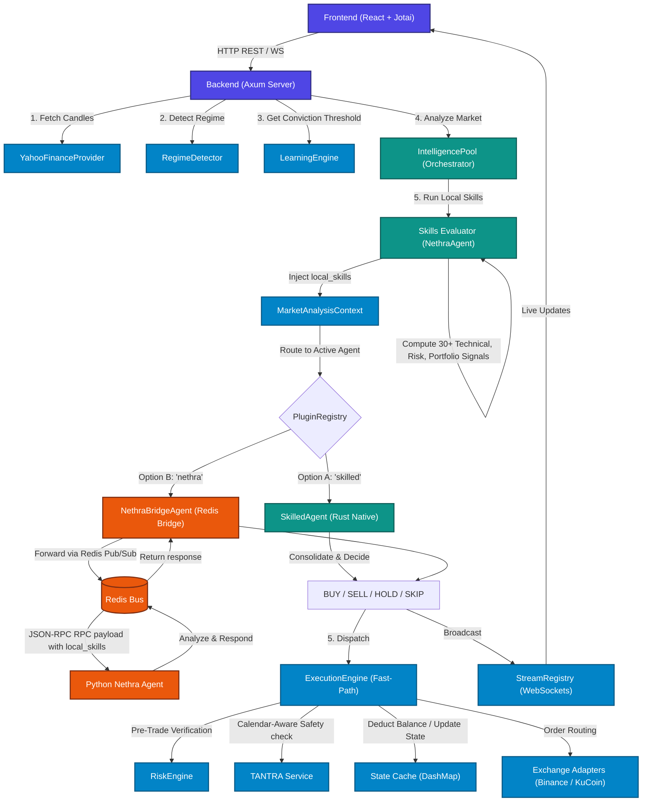

# TREDO — Autonomous Agent Trading Cockpit

> **Built on the Sethu Bridge Architecture**  
> A production-grade, modular AI trading orchestrator with a high-performance Rust backend and a reactive TypeScript frontend.

---

## Overview

**TREDO** is an enterprise autonomous quantitative trading system composed of three specialized modules, unified by the **Sethu Bridge** — a shared orchestration layer that synchronizes state, tools, skills, and database memory across all components.

### The Three Modules

| Module | Role |
|--------|------|
| **Chat** | Multi-agent communication hub for routing prompts to local Ollama models and specialized trading agents |
| **Tredo** | High-speed trading exchange dashboard — live orderbooks, automated bots, and execution automation |
| **Tantra** | Coworker & systems cockpit — collaborative tools, alert dispatch, and systems monitoring |

---

## Architecture

```
tredo/
├── Cargo.toml                    # Root Rust workspace manifest
├── package.json                  # Root NPM monorepo (Turborepo)
├── turbo.json                    # Turborepo pipeline config
├── docker-compose.yml            # Local dev stack (Prometheus, Grafana)
├── .env.example                  # Environment variables template
├── README.md
│
├── crates/                       # Rust library crates (workspace members)
│   ├── tredo-types/               # Shared types, enums, wire contracts (Borsh schemas)
│   ├── tredo-core/                # Re-exports & shared primitives
│   ├── tredo-execution/           # Fast-path ExecutionEngine (optimistic accounting, DashMap)
│   ├── tredo-intelligence/        # Slow-path LLM pool (Semaphore-gated, CoT-safe)
│   ├── tredo-exchange/            # Binance & KuCoin WebSocket adapters + User Data Streams
│   └── tredo-tantra/              # Alert dispatcher, systems logger, metrics monitor
│
├── backend/                      # tredo-server binary package (Axum v0.7)
│   ├── Cargo.toml
│   └── src/
│       ├── main.rs               # Thin entrypoint delegating to lib
│       ├── lib.rs                # Server bootstrap — spawns all engines & starts Axum
│       └── routes.rs             # HTTP REST + WebSocket upgrade handlers
│
├── frontend/                     # React + Vite + TypeScript UI
│   ├── src/
│   │   ├── app/                  # Root layout, main.tsx, index.css (Tailwind)
│   │   ├── atoms/                # Jotai atomic state (Chat, Tredo, Tantra)
│   │   ├── components/           # OrderBookCanvas, ManualOverridePanel, LivePriceTicker
│   │   ├── workers/              # Web Worker for Borsh binary stream deserialization
│   │   └── services/             # marketDataBridge, WS client services
│   └── public/
│
├── protocols/                    # Canonical wire contracts
│   ├── borsh/                    # Binary schema definitions
│   │   ├── orderbook.borsh
│   │   ├── trade.borsh
│   │   └── alert.borsh
│   └── ts/index.ts               # TypeScript type mirrors (generated from Borsh)
│
└── deployment/                   # Infrastructure
    ├── nginx.conf                # Reverse proxy + WebSocket upgrade + COOP/COEP headers
    ├── Dockerfile.backend        # Multi-stage Rust release build
    └── Dockerfile.frontend       # Static React build served via NGINX
```

### Agent Interaction Flow



---

## Technology Stack

### Backend (Rust)
| Layer | Technology / Library | Purpose |
|-------|----------------------|---------|
| **HTTP Server** | `axum` v0.7 | High-performance asynchronous web routing and WebSocket handlers |
| **Async Runtime** | `tokio` v1 | Multi-threaded task spawning, timers, channels, and event loop management |
| **Shared State** | `dashmap` | Lock-free concurrent hashmap for holding thread-safe real-time state |
| **Serialization** | `borsh` v1 + `serde` | Zero-copy high-speed binary protocols (Borsh) + robust JSON APIs (Serde) |
| **Database Engine** | `rusqlite` + `tokio-rusqlite` | Embedded SQLite engine for storing historical trade logs and decisions |
| **Network Clients** | `reqwest` | Asynchronous client for signed, authenticated exchange REST APIs |
| **Diagnostics** | `tracing` + `tracing-subscriber` | Structured application logging, metrics collection, and tracing layers |
| **Identifiers & Time**| `uuid` v4 + `chrono` | Cryptographically secure unique IDs and nanosecond-precision clocks |

### Frontend (TypeScript)
| Layer | Technology / Library | Purpose |
|-------|----------------------|---------|
| **Framework** | React 18 + Vite | Modular UI component design and modern high-speed development server |
| **State Management** | Jotai (atomic) | Fast, zero re-render state atoms avoiding virtual DOM overhead |
| **Styling Engine** | TailwindCSS | Glassmorphic, modern responsive dark-theme design system |
| **Charting Engine** | `lightweight-charts` | High-fidelity canvas-based interactive trade charting |
| **OrderBook Renderer**| HTML5 Canvas API | High-speed order book rendering running directly inside a Web Worker |
| **Wire Protocol** | Borsh (JS/TS) | Native binary deserialization of backend updates inside Worker threads |
| **Utility Suite** | `tailwind-merge` + `clsx` | Dynamic merging and conditional application of CSS selectors |


---

## Key Design Principles

### 1. Optimistic Accounting
The `ExecutionEngine` deducts balance and registers in-flight orders **before** the exchange confirms a fill. If the order fails, a refund task restores the full amount. This gives sub-millisecond UI feedback with zero over-trading risk.

### 2. Semaphore-Gated Intelligence Pool
The `IntelligencePool` limits concurrent LLM calls via a `tokio::sync::Semaphore`. This prevents model overloading while maintaining Chain-of-Thought (CoT) safety across simultaneous agent prompts.

### 3. Zero-Copy Order Book Rendering
Binary Borsh payloads are deserialized inside a **Web Worker** and transferred to the main thread via `postMessage` with **transferable `ArrayBuffer`** ownership. The canvas renders directly from `Float64Array` buffers — zero garbage-collector pressure at 60fps.

### 4. COOP/COEP Headers (SharedArrayBuffer)
NGINX is configured with `Cross-Origin-Opener-Policy: same-origin` and `Cross-Origin-Embedder-Policy: require-corp` to unlock `SharedArrayBuffer` for potential shared-memory communication between main thread and workers.

---

## Dual-Model LLM Isolation Architecture

To ensure high availability, zero latency-related blocks on trading execution, and bulletproof safety, TREDO uses a **Dual-Model Local/Cloud Split**:

1. **Local Ollama Model (`nemotron-3-nano:4b`)**:
   - Used for all standard, fast-path execution sub-agents in the 5-Bot Swarm (Technician Alpha, Portfolio Steward, Market Scout, Sentiment Oracle).
   - Allows fully private, local, and rate-limit-free real-time calculations.
2. **Cloud Gemini Model (`gemini-2.5-flash`)**:
   - Used exclusively for high-grade strategic reasoning, safety-critical assessments, and webhook validations.
   - Powers the **Risk Sentinel** (`risk_01`), the **Nethra Swarm Coordinator** strategic summaries, and the **cTrading Webhook Safety Lock** confirmations.

---

## Running Locally

### Prerequisites
- Rust `>=1.82` (`rustup update`)
- Node.js `>=18`
- Ollama (for local LLM inference): `ollama pull nemotron-3-nano:4b`

### 1. Start the Backend
```bash
# From the project root
cargo run -p tredo-server
# Listening on http://0.0.0.0:8080
```

### 2. Start the Frontend
```bash
# From the project root
cd frontend
npm install
npm run dev
# Serving on http://localhost:3000
```

---

## API Endpoints

| Method | Path | Description |
|--------|------|-------------|
| `GET` | `/api/health` | System health check |
| `GET` | `/api/autotrade/status` | Current auto-trading loop active configuration and status |
| `POST` | `/api/autotrade/start` | Start the autonomous background trading loop |
| `POST` | `/api/autotrade/stop` | Pause the autonomous background trading loop |
| `GET` | `/api/journal/stats` | Retrieve SQLite-persisted trade performance metrics |
| `POST` | `/api/webhook/google-trading` | cTrading HFT Webhook endpoint with high-grade Gemini safety lock confirmation |
| `WS` | `/ws` | Live Level 2 orderbook, decisions, and system alerts WS stream |

---

## Environment Variables

Copy `.env.example` to `.env` and configure your settings:

```bash
cp .env.example .env
```

| Variable | Description |
|----------|-------------|
| `PORT` | HTTP server port (default: `8080`) |
| `OLLAMA_BASE_URL` | Local Ollama endpoint (default: `http://localhost:11434`) |
| `DEFAULT_MODEL` | Active local LLM model name (default: `nemotron-3-nano:4b`) |
| `DATABASE_URL` | SQLite or Postgres connection string (default: `sqlite://tredo.db`) |
| `BINANCE_API_KEY` | Binance exchange API key |
| `BINANCE_SECRET_KEY` | Binance exchange secret |
| `KUCOIN_API_KEY` | KuCoin exchange API key |
| `KUCOIN_SECRET_KEY` | KuCoin exchange secret |
| `GEMINI_API_KEY` | Google Gemini Cloud API key (for safety verification locks & risk assessing) |

---

## Workspace Crate Reference

The TREDO workspace consists of 12 modular Rust crates:

| Crate | Path | Role |
|-------|------|------|
| `tredo-types` | `crates/tredo-types` | Shared structural primitives, state representations, and command sets |
| `tredo-core` | `crates/tredo-core` | Re-exports core structures and types |
| `tredo-skills` | `crates/tredo-skills` | Consolidates the **30+ native technical, risk, and portfolio analysis indicators** |
| `tredo-intelligence` | `crates/tredo-intelligence` | Handles the semaphore-gated LLM orchestration pool |
| `tredo-bridge` | `crates/tredo-bridge` | Facilitates bidirectional Redis pub/sub discovery with external Python bridges |
| `tredo-swarm` | `crates/tredo-swarm` | Orchestrates the multi-turn cooperative **5-Bot Swarm** |
| `tredo-autotrader` | `crates/tredo-autotrader` | Runs background autonomous execution and analysis loops |
| `tredo-data` | `crates/tredo-data` | High-fidelity market data handlers (e.g. YahooFinance API) |
| `tredo-learning` | `crates/tredo-learning` | Tracks win-rates and optimizes indicator conviction/thresholds |
| `tredo-stream` | `crates/tredo-stream` | Multi-threaded WebSocket broadcasting network registry |
| `tredo-execution` | `crates/tredo-execution` | Fast-path optimistic accounting and exchange order routers |
| `tredo-tantra` | `crates/tredo-tantra` | System alerts, security validations, and calendar risk guardians |
| `tredo-mcp` | `crates/tredo-mcp` | Model Context Protocol SSE handler and agent tools bridge |
| `tredo-server` | `backend/` | Axum HTTP server and central workspace initialization binary |

---

## Testing Suite

TREDO maintains rigorous unit and integration testing pipelines across both back and front ends.

### 1. Backend Rust Integration Tests
To execute backend database, REST, journal, and loop integration test blocks:
```bash
cargo test --test tredo_integration
```

### 2. Frontend React/Jotai Unit Tests
To run all client component, atomic state, and simulated trade feed mock tests:
```bash
cd frontend
npm run test
```

---

## Build Status

```
✅ cargo check — 0 errors, 0 warnings (100% clean)
✅ All 13 workspace crates compile successfully
✅ Frontend Vite build compilation verified
```

---

*TREDO is part of the Nethra autonomous intelligence ecosystem.*

