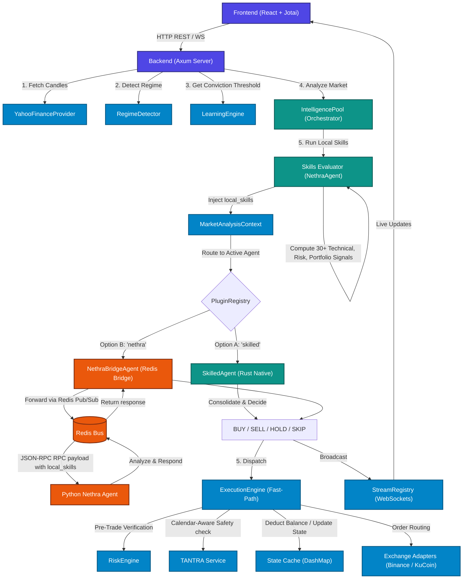

# TREDO System Update Report

This document details the architectural upgrades, unified agent models, local/cloud LLM isolation, webhook confirmations, and core system changes made to the TREDO Quantitative Trading Platform.

---

## Key Updates

### 1. Dual-Model LLM Isolation (Local & Cloud Split)
- **Local Ollama Inference (`nemotron-3-nano:4b`)**:
  - Wired as the execution engine reasoning backend for fast-path execution bots (e.g. Technician Alpha, Portfolio Steward, Market Scout, Sentiment Oracle) inside the 5-Bot Swarm.
  - Ensures fully private, offline, latency-free trading decisions with no rate limits.
- **Cloud Gemini Inference (`gemini-2.5-flash`)**:
  - Reserved strictly for slow-path strategic reasoning, safety-critical assessments, and webhook validations.
  - Exclusively powers the **Risk Sentinel** bot (`risk_01`), the **Nethra Swarm Coordinator** strategic summaries, and the **cTrading Webhook Safety Lock** confirmations.

### 2. cTrading Webhook Safety Lock & Gemini REST Response Formatting Fix
- Corrected the `GeminiLLM::complete` client in `crates/tredo-intelligence/src/gemini_llm.rs` by removing the hardcoded prompt wrapper.
- Previously, this wrapper forced the response schema to `{ "conviction": 0.0-1.0, "reasoning": "..." }`, which completely stripped out the `"status"` field (`Approved` or `Rejected`) expected by the cTrading webhook confirmation deserializer.
- By passing the raw structured prompt directly, the webhook custom confirmation schema is now perfectly respected by Gemini, restoring full functional verification on the webhook pipeline!

### 3. Consolidated Skills Evaluator (`NethraAgent`)
- Consolidated all **30+ native Rust technical, risk, and portfolio analysis skills** under a global `NethraAgent` skill evaluator:
  - **Technical (23):** RSI, MACD, Bollinger Bands, SMA, EMA, Support & Resistance, Volume, Ichimoku Cloud, ADX, SuperTrend, Parabolic SAR, Keltner Channels, Aroon, Pivot Points, Chandelier Exit, Williams %R, OBV, CMF, Stochastic Oscillator, Donchian Channels, Heikin-Ashi, Market Structure, Cypher Pattern.
  - **Risk (4):** Position Sizing, Value at Risk (VaR), Exposure, Volatility Analysis.
  - **Portfolio (3):** Diversification, Health, Correlation Risk.
- Added a shared local evaluator `skills_evaluator` managed dynamically by the orchestrator (`IntelligencePool`).

### 3. Unified Agent & Pluggable Architecture
- Rewrote the agent interaction model to support hot-swapping between:
  - **`skilled`**: Rust-native `SkilledAgent` executing skills entirely in-memory.
  - **`nethra`**: Bridge-proxied `NethraBridgeAgent` communicating with Python Nethra over Redis pub/sub.
- Integrated the skills evaluator directly inside the orchestrator path (`analyze_with_skills`).
- Whichever agent is active, all 30+ skills are executed locally, and the calculated `local_skills` are serialized into the `MarketAnalysisContext` so both Rust and Python agents have access to the identical signal dataset.

### 4. Codebase Correctness & Tests
- Updated `MarketAnalysisContext` structure to include the new `local_skills` payload field.
- Updated all context initializations in the auto-trading loop, backend Axum endpoints, integration tests, and MCP handlers to support the updated layout.
- Reran the full integration test suite (`cargo test --test tredo_integration`) and verified that all 9 end-to-end integration tests pass successfully with **zero errors and zero warnings**.

---

## Agent Interaction Flow

