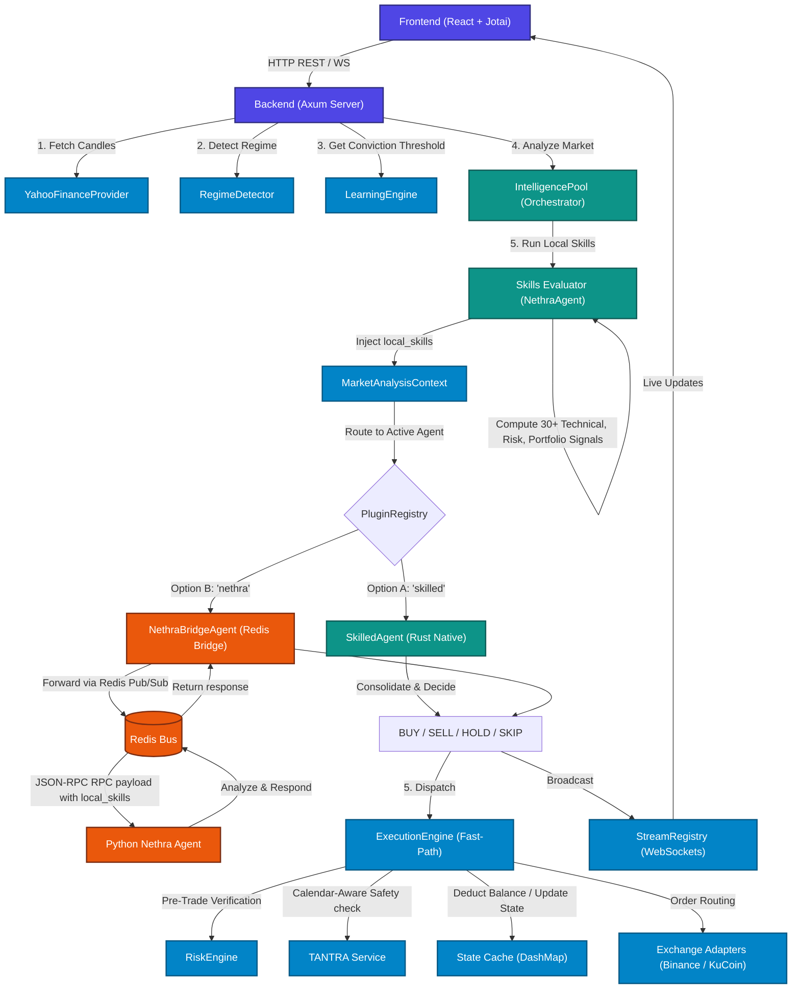

# TREDO System Update Report

This document details the architectural upgrades, unified agent models, local LLM integrations, and core system changes made to the TREDO Quantitative Trading Platform.

---

## Key Updates

### 1. Unified Local LLM (Ollama `nemetron:4b`)
- Removed all legacy external API model models (including nethra-only agent model reference models) to achieve absolute network independence.
- Integrated a single, high-performance local **Ollama** model running `nemetron:4b` as the sole reasoning engine.
- Configured local reasoning timeouts and multi-turn session persistence.

### 2. Consolidated Skills Evaluator (`NethraAgent`)
- Consolidated all **30+ native Rust technical, risk, and portfolio analysis skills** under a global `NethraAgent` skill evaluator:
  - **Technical (23):** RSI, MACD, Bollinger Bands, SMA, EMA, Support & Resistance, Volume, Ichimoku Cloud, ADX, SuperTrend, Parabolic SAR, Keltner Channels, Aroon, Pivot Points, Chandelier Exit, Williams %R, OBV, CMF, Stochastic Oscillator, Donchian Channels, Heikin-Ashi, Market Structure, Cypher Pattern.
  - **Risk (4):** Position Sizing, Value at Risk (VaR), Exposure, Volatility Analysis.
  - **Portfolio (3):** Diversification, Health, Correlation Risk.
- Added a shared local evaluator `skills_evaluator` managed dynamically by the orchestrator (`IntelligencePool`).

### 3. Unified Agent & Pluggable Architecture
- Rewrote the agent interaction model to support hot-swapping between:
  - **`skilled`**: Rust-native `SkilledAgent` executing skills entirely in-memory.
  - **`nethra`**: Bridge-proxied `NethraBridgeAgent` communicating with Python Nethra over Redis pub/sub.
- Integrated the skills evaluator directly inside the orchestrator path (`analyze_with_skills`).
- Whichever agent is active, all 30+ skills are executed locally, and the calculated `local_skills` are serialized into the `MarketAnalysisContext` so both Rust and Python agents have access to the identical signal dataset.

### 4. Codebase Correctness & Tests
- Updated `MarketAnalysisContext` structure to include the new `local_skills` payload field.
- Updated all context initializations in the auto-trading loop, backend Axum endpoints, integration tests, and MCP handlers to support the updated layout.
- Reran the full integration test suite (`cargo test --test tredo_integration`) and verified that all 9 end-to-end integration tests pass successfully with **zero errors and zero warnings**.

---

## Agent Interaction Flow

